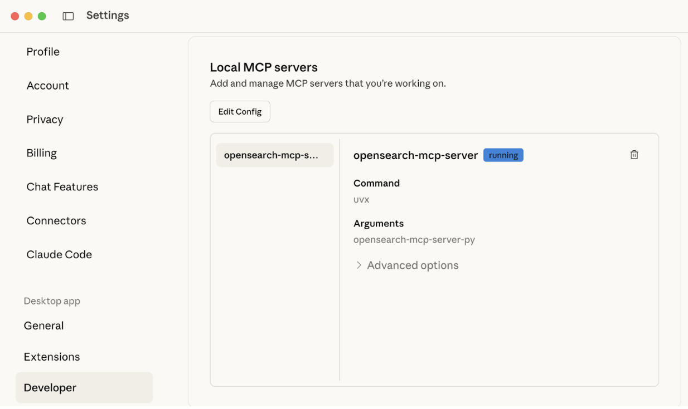
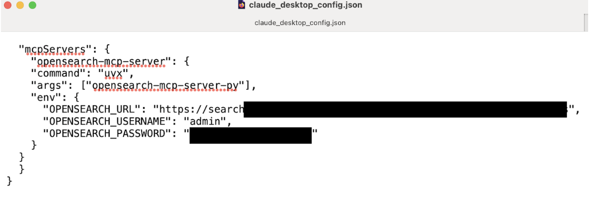
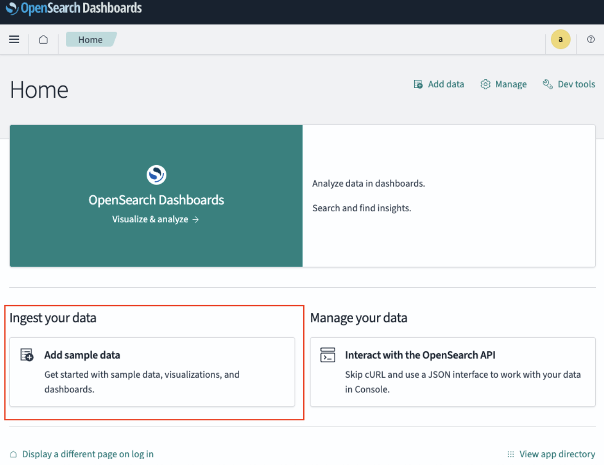
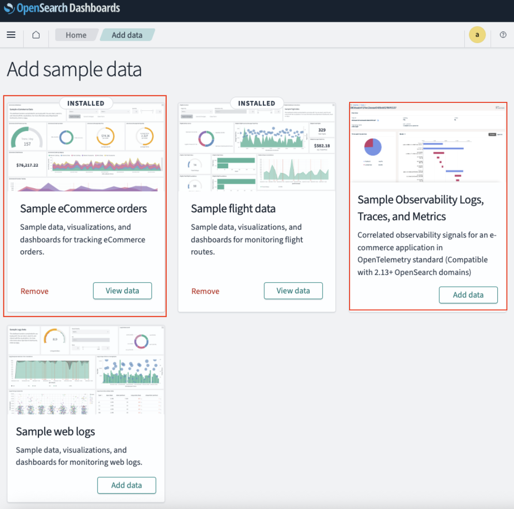
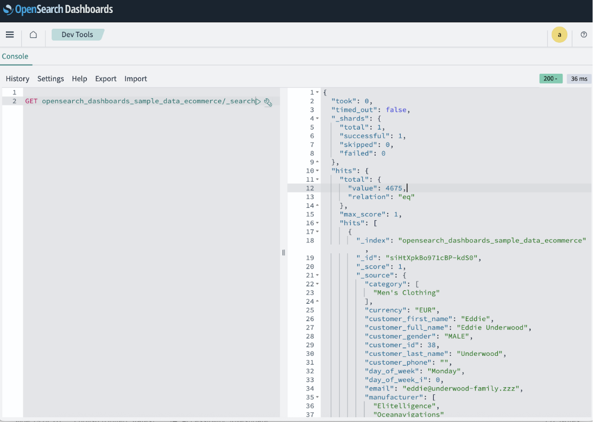

# NextGenSearch OpenSearch MCP Demo

A complete demonstration project showcasing OpenSearch integration with Model Context Protocol (MCP) for natural language interactions with Amazon Q and Anthropic Claude Desktop.

Next-gen AI search with Large Language Models(LLM) &  Model Context Protocol (MCP) expands capabilities with natural language queries with persistent memory to provide conversational search experiences.

Model Context Protocol is emerging as a de facto standard for RAG (Retrieval Augment Generation) and Knowledge Bases integrations, allowing multiple AI agents to connect seamlessly with services to augment LLM responses

## Demo
https://www.youtube.com/watch?v=bHra8VwQvR8

## 🚀 Quick Start

Clone this repository and get up and running in minutes:

### macOS/Linux:
```bash
git clone https://github.com/daggumalli/NextGenSearch-OpenSearch-MCP.git
cd NextGenSearch-OpenSearch-MCP
./setup.sh
```

### Windows:
```cmd
git clone https://github.com/daggumalli/NextGenSearch-OpenSearch-MCP.git
cd NextGenSearch-OpenSearch-MCP
setup.bat
```

## 📋 Prerequisites

- Docker and Docker Compose installed
- Python 3.10+ installed
- uv installed (Python package manager) - automatically installed by setup script
- Amazon Q CLI or Anthropic Claude Desktop
- Minimum 16GB RAM (32GB recommended)

## 🏗️ How It Works

### Architecture Flow
```
👤 User Query → 🤖 Claude Desktop → 📡 MCP Protocol → 🔧 OpenSearch MCP Server → 🔍 OpenSearch Service
                                                                                           ↓
📊 Sample Data ← 📚 Books Index + 🛍️ Products Index + 📰 Articles Index ←────────────────┘
```

### Component Interaction:
1. **User** asks natural language question in Claude Desktop
2. **Claude Desktop** sends MCP request to OpenSearch MCP Server
3. **MCP Server** translates to OpenSearch API calls
4. **OpenSearch** processes queries and returns results
5. **Response flows back** through the chain to the user

## 🖥️ Cross-Platform Support

This demo works on **Windows, macOS, and Linux**:

- **Windows**: Use `setup.bat` and `.bat` scripts
- **macOS/Linux**: Use `setup.sh` and `.sh` scripts
- **Docker**: Identical across all platforms
- **MCP Server**: Works with `uvx` on all platforms

### Windows-Specific Notes:
- Requires PowerShell for `uv` installation
- Uses `%APPDATA%\Claude\` for Claude Desktop config
- Auto-detects `uvx.exe` path in `%USERPROFILE%\.local\bin\`

## 🏗️ What's Included

- **Local OpenSearch Instance**: Complete Docker setup with security enabled
- **Sample Data**: Pre-loaded datasets for immediate testing
- **MCP Server Configuration**: Ready-to-use configurations for both Amazon Q and Claude
- **Example Queries**: Natural language examples to get you started
- **Automated Setup**: One-command deployment

## 📁 Project Structure

```
├── docker/                 # Docker configurations
│   ├── docker-compose.yml  # OpenSearch and Dashboards setup
│   └── certs/              # SSL certificates (generated)
├── data/                   # Sample datasets
│   └── sample_datasets.json
├── configs/               # MCP configurations
│   ├── claude_desktop_config.json
│   └── amazon_q_mcp.json
├── scripts/               # Setup and utility scripts
│   ├── load_sample_data.sh    # macOS/Linux
│   ├── load_sample_data.bat   # Windows
│   ├── setup_mcp_configs.sh   # macOS/Linux
│   └── setup_mcp_configs.bat  # Windows
├── examples/              # Example queries and use cases
│   └── natural_language_queries.md
├── docs/                  # Additional documentation
│   └── SETUP_GUIDE.md
├── setup.sh              # Main setup script (macOS/Linux)
└── setup.bat             # Main setup script (Windows)
```

## Setup

1. **Clone and Setup**:
Upon successfull installation of the setup scripts

2. **Access OpenSearch**:
   - OpenSearch API: https://localhost:9200
   - OpenSearch Dashboards: https://localhost:5601
   - Default credentials: `admin` / `yourStrongPassword123!`

3. **Configure Your LLM**:
   - The setup script automatically configures both Claude Desktop (https://www.claude.com/download) and Amazon Q
   - After Claude desktop installation, navigate to profile >> settings >> Developer >> Edit config (Local MCP Servers)
    
   - Update configuration file information with the config/claude_desktop_config.json
    
   - Remember to use the correct path for uvx in your "command": "/Users/**srikanthdaggumalli**/.local/bin/uvx",
   - **Auto-detects the correct uvx path** for your system
   - Restart your LLM application to load the new configuration

4. **Add Sample Data**
   

   

5. **Verify Data from DevTools**
   
   
6. **Try Natural Language Queries**:
   ```
   "Show me all available indices"
   "Search for products"
   "Create a sales data insights"
   "give me performance bottlenecks from observability logs"
   ```

## 🔧 Manual Setup

If you prefer manual setup or need to customize the configuration, see our [detailed setup guide](docs/SETUP_GUIDE.md).

## 📊 Sample Data

The demo includes three pre-loaded indices with sample data:

- **sample_books**: Classic literature with metadata
- **sample_products**: E-commerce product catalog
- **sample_articles**: Technology articles and blog posts

## 💡 Example Use Cases

### E-commerce Search
```
"Find all electronics under $100 that are in stock"
"Show me the most expensive products by category"
"Search for wireless products with good ratings"
```

### Content Management
```
"Find articles about search technology published this year"
"Search for books by publication decade"
"Show me the most popular articles by views"
```

### Data Analysis
```
"What's the average rating of books by genre?"
"Count products by category and stock status"
"Show me price distribution across all products"
```

## 🛠️ Troubleshooting

### Quick Fixes

**MCP Server Not Found**:
- Check uvx path: `which uvx` (macOS/Linux) or `where uvx` (Windows)
- Restart your LLM application after setup
- See [detailed troubleshooting guide](docs/TROUBLESHOOTING.md#uvx-path-issues)

**OpenSearch Connection Failed**:
- Verify OpenSearch is running: `docker ps`
- Check logs: `docker-compose -f docker/docker-compose.yml logs opensearch`
- See [OpenSearch service issues](docs/TROUBLESHOOTING.md#opensearch-service-issues)

**Python Version Issues**:
- OpenSearch MCP Server requires Python 3.10+
- See [Python version troubleshooting](docs/TROUBLESHOOTING.md#python-version-issues)

**SSL Certificate Issues**:
- Check SSL environment variables in your MCP config
- See [SSL troubleshooting guide](docs/TROUBLESHOOTING.md#ssl-certificate-issues)

📚 **Comprehensive Guides**:
- [🔧 Complete Troubleshooting Guide](docs/TROUBLESHOOTING.md)
- [📖 Detailed Setup Guide](docs/SETUP_GUIDE.md)

## 🔒 Security Notes

This demo uses development-friendly settings:
- Self-signed SSL certificates
- Default passwords
- Disabled SSL verification

For production use:
- Use strong, unique passwords
- Implement proper SSL certificates
- Enable SSL verification
- Configure proper network security

## 🤝 Contributing

We welcome contributions! Please feel free to:
- Report bugs
- Suggest features
- Submit pull requests
- Improve documentation

## 📚 Documentation & Resources

### 📖 **Project Documentation**
- [🔧 Troubleshooting Guide](docs/TROUBLESHOOTING.md) - Common issues and solutions
- [📖 Detailed Setup Guide](docs/SETUP_GUIDE.md) - Manual installation steps
- [💡 Natural Language Examples](examples/natural_language_queries.md) - Query examples

### 🔗 **External Resources**
- [OpenSearch Documentation](https://opensearch.org/docs/latest/)
- [MCP Protocol Documentation](https://modelcontextprotocol.io/introduction)
- [Claude Desktop](https://claude.ai/desktop) - Download Claude Desktop
- [Amazon Q](https://aws.amazon.com/q/) - AWS AI Assistant

## 🛑 Stopping the Demo

To stop all services:
```bash
docker-compose -f docker/docker-compose.yml down
```

To remove all data:
```bash
docker-compose -f docker/docker-compose.yml down -v
```

---

**Happy Searching!** 🔍✨
